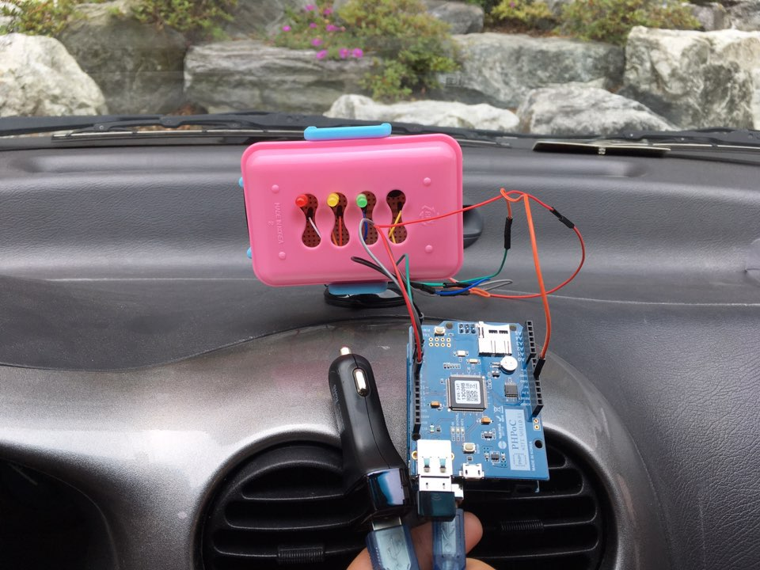
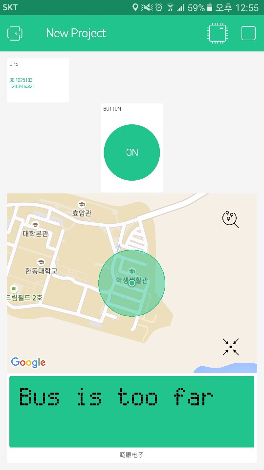
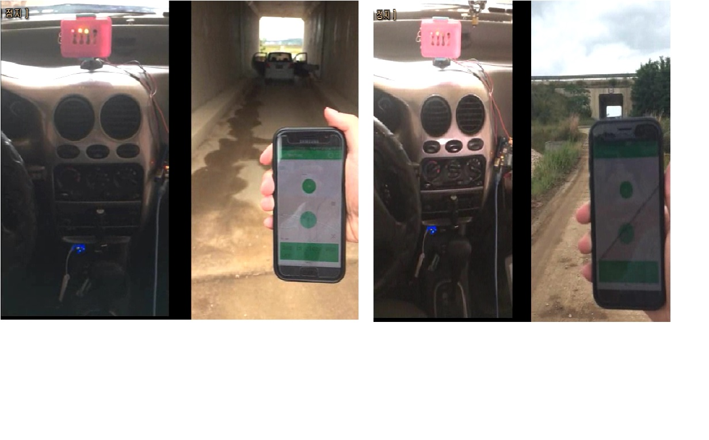

#BusStopper

This program is developed for stopping the bus nearby.  
It's using an Arduino board interacting with a Blynk server.  
Main program is Busstopper.ino which is using blynk.  
  
If an user sends a signal using blynk application,  
the signal will be sent to a bus driver which has an arduino device.  
After receiving the signal, the bus driver can make a decision whether wait for the user for a while or not.  
The signal strength is vary by the user's GPS location.  

  
This is an image of the hardware, using LED x 3, Piezo buzzer
  
  
This is an image of the blynk application. Shows current location tracked by GPS.
  
  
This is the image of the results. The LED level is vary by the distance between the user and the device.
